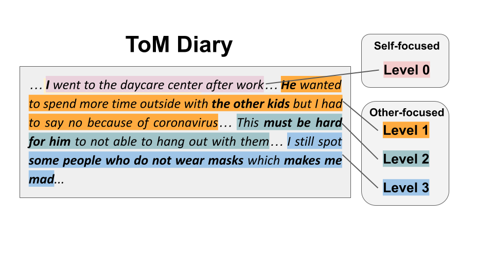

## Computational Approach to Measure Empathy and Theory-of-Mind from Written Texts

## Data and Label Description
<br>



<br>

<br>

- There were four levels: level 0, 1, 2, 3
- Level 0 : no mention of other's presense.
- Level 1 : mentions others' behaviors only.
- Level 2 : mentions other's mental state but refuse or fail to take perspective of them.
- Level 3 : mentions other's mental state and take perspective of them.
- Each sentence was annotated by psychology major students and was reviewed by psychology experts (graduate students)

<br>

## Example

	sent,tom_level
	무작정 회화 학원에 나가 말하는 연습을 하기 시작한 게 벌써 3개월이나 지났다.,0
	며칠 전 친구들과 배달을 시키면서 처음 먹어보는 메뉴를 골랐는데 생각보다 맛이 없었다. ,1
	마스크를 안 썼으면 몸을 사리기라도 해야 하는데 꼭 그런 사람들이 지하철에서 진상 짓을 하고 본인이 진상인지도 몰라서 너무 짜증난다. ,2
	휴학하고 나는 밖에는 자주 나가지 못하지만 집에서 쉬어 좋았는데, 비대면 수업을 듣는 다른 친구들은 평소보다 더한 과제 양에 지친 듯하였다. ,3

<br>

## File Description <br>

	sent : sentence <br>
	tom level: Theory of Mind level annotated to each sentence. <br>
<br>

License: CC-BY-NC-SA 4.0

<br>

Test data used for model inference is at ```/data```. <br>

Train data are available to only researchers from verified institutions due to privacy concerns (e.g., mental health and personal experiences) <br>

Contact: <br>
snuhahnlab@gmail.com <br>
Human Factors Psychology Laboratory, <br>
Seoul National University, Korea 
